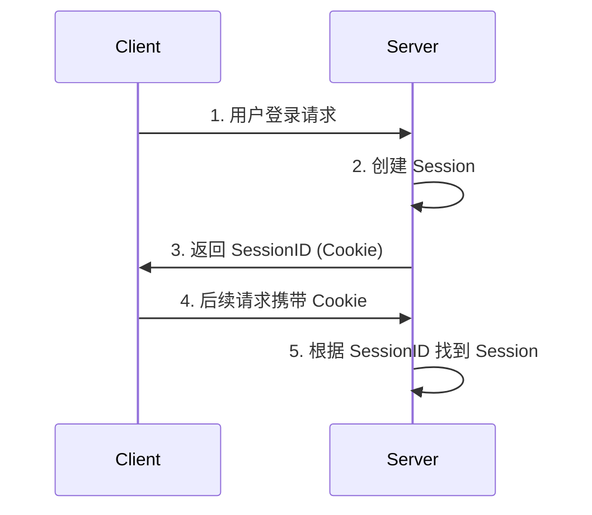

# 深入理解 HTTP 状态保持：Session、Cookie 与 JWT

## 引言

在现代 Web 应用中,几乎所有网站都需要实现用户登录和状态保持功能。但是 HTTP 协议本身是无状态的,这意味着服务器无法识别来自同一用户的不同请求之间的关系。那么,网站是如何实现登录状态的持久化呢？本文将深入探讨两种主流的状态保持方案。

## HTTP 的无状态性

HTTP 协议的无状态性是指:

- 每个请求都是独立的
- 服务器不会保存前后请求之间的关系
- 服务器无法识别请求是否来自同一个用户

为了解决这个问题,我们需要给 HTTP 请求添加一些额外的标识。目前主流的解决方案有两种:

1. Session + Cookie 方案
2. JWT (JSON Web Token) 方案

让我们详细分析这两种方案的原理、优缺点和最佳实践。

## Session + Cookie 方案

### 工作原理



1. 用户首次登录后,服务器创建 Session 对象
2. 服务器生成唯一的 SessionID
3. 通过 Set-Cookie 响应头将 SessionID 发送给客户端
4. 浏览器后续请求自动携带包含 SessionID 的 Cookie
5. 服务器通过 SessionID 找到对应 Session,实现状态关联

### 存在的问题

1. CSRF 攻击风险
   - Cookie 会被自动携带
   - 容易受到跨站请求伪造攻击
2. 分布式环境的 Session 同步问题

   - 多服务器之间 Session 数据不共享
   - 需要额外的 Session 共享机制

3. 跨域限制
   - Cookie 有域名限制
   - 跨域请求需要特殊处理

### 解决方案

1. CSRF 防护

```javascript
// 前端
const csrfToken = response.headers['x-csrf-token']
axios.defaults.headers['X-CSRF-Token'] = csrfToken

// 后端
app.use(csrf())
```

2. 分布式 Session

```javascript
// 使用 Redis 存储 Session
const session = require('express-session')
const RedisStore = require('connect-redis')(session)

app.use(
  session({
    store: new RedisStore({ client: redisClient }),
    secret: 'your-secret',
  })
)
```

## JWT 方案

### 工作原理

JWT 由三部分组成:

1. Header (头部)
2. Payload (负载)
3. Signature (签名)

```javascript
// JWT 创建示例
const jwt = require('jsonwebtoken')

const token = jwt.sign({ userId: user.id }, 'secret-key', { expiresIn: '24h' })
```

### 优势

1. 无状态,易于扩展
2. 不依赖 Cookie,没有跨域问题
3. 避免了 CSRF 攻击

### 存在的问题

1. Token 无法主动失效
2. 安全性依赖传输层
3. 性能开销较大

### 最佳实践

```javascript
// JWT + Redis 方案
const jwt = require('jsonwebtoken')
const redis = require('redis')

async function createToken(user) {
  const token = jwt.sign({ userId: user.id }, 'secret')
  await redis.set(`token:${user.id}`, token)
  return token
}

async function validateToken(token) {
  const decoded = jwt.verify(token, 'secret')
  const storedToken = await redis.get(`token:${decoded.userId}`)
  return token === storedToken
}
```

## 方案选择建议

1. 选择 Session + Cookie:

   - 传统的服务端渲染应用
   - 需要严格的安全控制
   - 数据量较大的场景

2. 选择 JWT:
   - 微服务架构
   - API 服务
   - 移动应用后端

## 总结

没有完美的解决方案,需要根据具体场景选择合适的方案:

- Session + Cookie 方案更适合传统 Web 应用
- JWT 方案更适合现代分布式系统
- 可以结合 Redis 等工具优化两种方案
- 安全性、性能、可维护性需要权衡

最后,推荐在实际项目中采用:

- Session + Redis 方案
- JWT + Redis 方案

这样可以综合两种方案的优点,规避各自的缺点。
