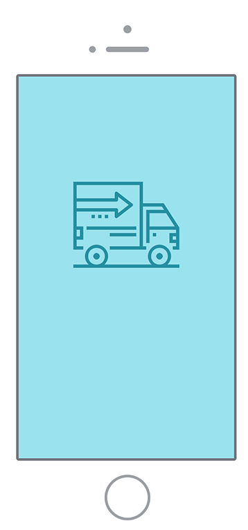

# Swiper触摸滑动插件


## Swiper是什么

- 开源、免费、强大的触摸滑动插件
- 在移动端和PC端使用


## 可以做什么

- 实现移动端和PC端的大部分滑动功能
  - 幻灯片	
  - Tab选项卡
  - 页面滑动切换
  - .......
- Swiper官网 https://www.swiper.com.cn/


## Swiper 的使用流程


```js
<!DOCTYPE html>
<html lang="en">
  <head>
    <meta charset="UTF-8" />
    <meta name="viewport" content="width=device-width, initial-scale=1.0" />
    <title>Swiper 的使用方法</title>
    <link rel="stylesheet" href="./swiper-bundle.min.css">
    <style>
      * {
        margin: 0;
        padding: 0;
      }
      .swiper-container {
        width: 375px;
        height: 300px;
      }
      .swiper-slide {
        display: flex;
        justify-content: center;
        align-items: center;
        font-size: 80px;
      }
    </style>
  </head>
  <body>
    <div id="swiper" class="swiper-container">
      <div class="swiper-wrapper">
        <div class="swiper-slide">Slide 1</div>
        <div class="swiper-slide">Slide 2</div>
        <div class="swiper-slide">Slide 3</div>
      </div>
      <!-- 如果需要分页器 -->
      <div class="swiper-pagination"></div>

      <!-- 如果需要导航按钮 -->
      <div class="swiper-button-prev"></div>
      <div class="swiper-button-next"></div>

      <!-- 如果需要滚动条 -->
      <div class="swiper-scrollbar"></div>
    </div>

    <script src="./swiper-bundle.min.js"></script>
    <script>
      // 1.Swiper 的使用流程
      // 1.1.加载 Swiper 文件
      // 加载 swiper-bundle.min.js 和 swiper-bundle.min.css 文件

      // 1.2.完成 Swiper 的 HTML 结构和 CSS 样式

      // 1.3.初始化 Swiper
      const mySwiper = new Swiper ('#swiper', {
        // direction: 'vertical', // 垂直切换选项
        loop: true, // 循环模式选项
        
        // 如果需要分页器
        pagination: {
          el: '.swiper-pagination',
        },
        
        // 如果需要前进后退按钮
        navigation: {
          nextEl: '.swiper-button-next',
          prevEl: '.swiper-button-prev',
        },
        
        // 如果需要滚动条
        scrollbar: {
          el: '.swiper-scrollbar',
        },
      });

      // 2.版本升级怎么办
      // 一切以官网为准
      // Swiper 官网：https://www.swiper.com.cn
      // Swiper 使用方法：https://www.swiper.com.cn/usage/index.html
      // 各种版本下载地址：https://github.com/nolimits4web/swiper
    </script>
  </body>
</html>
```


## Swiper 的常用 API

- Swiper初始化
- 基础配置
- 事件
- 属性
- 方法
- 控制


###  1.Swiper 初始化

```html
<!DOCTYPE html>
<html lang="en">
  <head>
    <meta charset="UTF-8" />
    <meta name="viewport" content="width=device-width, initial-scale=1.0" />
    <title>Swiper 的常用 API</title>
    <link rel="stylesheet" href="./swiper-bundle.min.css" />
    <style>
      * {
        margin: 0;
        padding: 0;
      }
      .swiper-container {
        width: 375px;
        height: 300px;
      }
      .swiper-slide {
        display: flex;
        justify-content: center;
        align-items: center;
        font-size: 80px;
      }
    </style>
  </head>
  <body>
    <div id="swiper" class="swiper-container">
      <div class="swiper-wrapper">
        <div class="swiper-slide">Slide 1</div>
        <div class="swiper-slide">Slide 2</div>
        <div class="swiper-slide">Slide 3</div>
      </div>
      <!-- 如果需要分页器 -->
      <div class="swiper-pagination"></div>

      <!-- 如果需要导航按钮 -->
      <div class="swiper-button-prev"></div>
      <div class="swiper-button-next"></div>

      <!-- 如果需要滚动条 -->
      <div class="swiper-scrollbar"></div>
    </div>

    <button id="btn-prev">上一个</button>
    <button id="btn-next">下一个</button>
    <button class="btn-index" data-index="0">1</button>
    <button class="btn-index" data-index="1">2</button>
    <button class="btn-index" data-index="2">3</button>

    <script src="./swiper-bundle.min.js"></script>
    <script>
      	// 用于初始化一个 Swiper，返回初始化后的 Swiper 实例
     	const mySwiper = new Swiper(swiperContainer, parameters);
    </script>
  </body>
</html>
```


###  2.基础配置

- initialSlide 设定初始化时 slide 的索引
- direction 滑动方向
- speed 切换速度
- effect 切换效果，默认为位移切换
- fadeEffect true和false决定是否开启淡出
- grabCursor 设置为 true 时，鼠标覆盖 Swiper 时指针会变成手掌形状
- slidesPerView 设置 slider 容器能够同时显示的 slide 数量
- freeMode 设置为 true 则变为 free 模式，slide 会根据惯性滑动可能不止一格且不会贴合（滑动菜单）
- loop 会在原本 slide 前后复制若干个(默认一个) slide，并在合适的时候切换，让Swiper 看起来是循环的
- on 注册事件

```js
<script>
    // 用于初始化一个 Swiper，返回初始化后的 Swiper 实例
    const mySwiper = new Swiper("#swiper", {
        initialSlide: 0,
        direction: 'horizontal', // 默认，水平切换
        // direction: 'vertical' // 垂直切换
        speed: 300, // 默认，300
        // effect: 'slide', // 默认，位移切换
        // effect: 'fade', // 淡入
        // fadeEffect: {
        //    crossFade: true
        // },
        // effect: 'cube' // 方块
        // effect: 'coverflow' // 3d流
        // effect: 'flip' // 3d翻转
        grabCursor: true,
        // slidesPerView: 2
        // freeMode: true
        // loop: true,
        on: {
            //初始化Swiper时自动触发 swiper 等于初始化返回的 Swiper 实例
            init(swiper) {
                // 里面的 this 就是 swiper实例 不要使用箭头函数!
                console.log(this === swiper); // true
            }
        }
    });
</script>
```


### 3.事件

- init 初始化后执行
- slideChangeTransitionStart 从当前 slide 开始过渡到另一个 slide 时执行
- slideChangeTransitionEnd 从一个 slide 过渡到另一个 slide 结束时执行

注意: 如果loop:true 则slideChangeTransitionStart 和 slideChangeTransitionEnd 会加载的时候执行一次，因为loop默认会复制首尾图片


### 4.属性

- activeIndex 返回当前 slide 的索引
- previousIndex 返回上一个 slide 的索引，切换前的索引
- width/height 获取 swiper 容器的宽/高

```js
	  on: {
          //初始化Swiper时触发 swiper 等于初始化返回的 Swiper 实例
          init(swiper) {
            // 里面的 this 就是 swiper实例 不要使用箭头函数!
            console.log(this === swiper); // true
            console.log(this.activeIndex);
            console.log(this.previousIndex);
            console.log(this.width, this.height);
          },

          slideChangeTransitionStart: function (swiper) {
            // console.log(this === swiper);
            // console.log('slideChangeTransitionStart');
            console.log(this.activeIndex);
            console.log(this.previousIndex);
          },
          slideChangeTransitionEnd: function (swiper) {
            // console.log(this === swiper);
            // console.log('slideChangeTransitionEnd');
          }
  		}
```


### 5.方法

- slideNext()/slidePrev() 切换到下/上一个滑块
- slideTo() 控制 Swiper 切换到指定 slide


```js
const $prevBtn = document.getElementById('btn-prev');
const $nextBtn = document.getElementById('btn-next');

$prevBtn.addEventListener(
    'click',
    () => {
        mySwiper.slidePrev();
    },
    false
);

$nextBtn.addEventListener(
    'click',
    () => {
        mySwiper.slideNext();
    },
    false
);

const $indexBtns = document.querySelectorAll('.btn-index');

for (const $el of $indexBtns) {
    $el.addEventListener(
        'click',
        () => {
            mySwiper.slideTo($el.dataset.index);
        },
        false
    );
}
```


### 6.控制

- autoplay 自动切换
- pagination 使用分页器导航
- navigation 使用前进后退按钮来控制 Swiper 切换
- scrollbar 为 Swiper 增加滚动条
- keyboard 开启键盘来控制 Swiper 切换
- mousewheel 开启鼠标滚轮控制 Swiper 切换

```js
const mySwiper = new Swiper('#swiper', {
    // autoplay: true,
    // autoplay: {
    //   delay: 1000,
    //   stopOnLastSlide: false,
    //   disableOnInteraction: true
    // }

    pagination: {
        el: '.swiper-pagination',
        clickable: true
    },

    navigation: {
        nextEl: '.swiper-button-next',
        prevEl: '.swiper-button-prev'
    },

    scrollbar: {
        el: '.swiper-scrollbar',
        draggable: true,
        dragSize: 30
    },

    keyboard: true,
    mousewheel: true
 })
```


## Tab切换

```html
<!DOCTYPE html>
<html lang="en">
  <head>
    <meta charset="UTF-8" />
    <meta name="viewport" content="width=device-width, initial-scale=1.0" />
    <title>Tab 切换</title>
    <link rel="stylesheet" href="./swiper-bundle.min.css" />
    <style>
      * {
        padding: 0;
        margin: 0;
        box-sizing: border-box;
        -webkit-tap-highlight-color: transparent;
      }
      a {
        text-decoration: none;
        color: #333;
      }
      a:hover {
        color: #409eff;
      }
      li {
        list-style: none;
      }
      body {
        padding: 24px;
      }
      .tab-header {
        display: flex;
        justify-content: space-between;
        line-height: 30px;
      }
      .tab-label-active {
        color: #409eff;
        border-bottom: 2px solid #409eff;
      }
      .tab-item {
        line-height: 40px;
        border-bottom: 1px solid #ebebeb;
      }
    </style>
  </head>
  <body>
    <div id="tab-header" class="tab-header">
      <a href="javascript:;" class="tab-label tab-label-active" data-index="0"
        >在线演示</a
      >
      <a href="javascript:;" class="tab-label" data-index="1">中文教程</a>
      <a href="javascript:;" class="tab-label" data-index="2">获取 Swiper</a>
    </div>
    <div id="tab-content" class="swiper-container">
      <div class="swiper-wrapper">
        <div class="swiper-slide">
          <ul>
            <li class="tab-item">Swiper 基础演示</li>
            <li class="tab-item">Swiper 精彩应用（移动）</li>
            <li class="tab-item">Swiper 精彩应用（PC）</li>
          </ul>
        </div>
        <div class="swiper-slide">
          <ul>
            <li class="tab-item">Swiper 使用方法</li>
            <li class="tab-item">Swiper Animate 使用方法</li>
            <li class="tab-item">Swiper 与 DOM</li>
          </ul>
        </div>
        <div class="swiper-slide">
          <ul>
            <li class="tab-item">下载 Swiper</li>
            <li class="tab-item">Swiper CDN 地址</li>
          </ul>
        </div>
      </div>
    </div>

    <script src="./swiper-bundle.min.js"></script>
    <script>
      const $tabHeader = document.getElementById('tab-header');
      const $tabLabels = $tabHeader.querySelectorAll('.tab-label');

      const tabSwiper = new Swiper('#tab-content', {
        autoplay: true,
        on: {
          slideChangeTransitionEnd() {
            // console.log(this.activeIndex);
            for (const $el of $tabLabels) {
              $el.classList.remove('tab-label-active');
            }
            $tabLabels[this.activeIndex].classList.add('tab-label-active');
          }
        }
      });

      // 点击切换选项卡--事件代理
      $tabHeader.addEventListener(
        'click',
        evt => {
          const $el = evt.target;

          if ($el.classList.contains('tab-label')) {
            tabSwiper.slideTo($el.dataset.index);
          }
        },
        false
      );
    </script>
  </body>
</html>
```


## 页面的滑动切换

```html
<!DOCTYPE html>
<html lang="en">
    <head>
        <meta charset="UTF-8" />
        <meta name="viewport" content="width=device-width, initial-scale=1.0" />
        <title>页面滑动切换</title>
        <link rel="stylesheet" href="./swiper-bundle.min.css" />
        <style>
            * {
                padding: 0;
                margin: 0;
            }
            .swiper-container {
                width: 100vw;
                height: 100vh;
            }
            .swiper-slide {
                overflow: hidden;
                position: relative;
                display: flex;
                justify-content: center;
            }
            .logistics-slide {
                background-color: #57cfe1;
            }
            .purchase-slide {
                background-color: #fe8e34;
            }
            .logistics-text,
            .purchase-text {
                position: absolute;
                width: 214px;
                opacity: 0;
                transition: all 1s 0.5s;
            }
            .logistics-text-active,
            .purchase-text-active {
                opacity: 1;
            }
            .logistics-text {
                top: 50px;
            }
            .purchase-text {
                bottom: 40px;
            }
            .logistics-phone,
            .logistics-person,
            .purchase-phone,
            .purchase-person {
                position: absolute;
                width: 180px;
                transition: all 0.5s;
            }
            .logistics-phone {
                bottom: 0;
                transform: translate3d(-1000px, 0, 0);
            }
            .logistics-phone-active {
                transform: translate3d(-70px, 0, 0);
            }
            .logistics-person {
                bottom: 0;
                transform: translate3d(1000px, 0, 0);
            }
            .logistics-person-active {
                transform: translate3d(70px, 0, 0);
            }
            .purchase-person {
                top: 50px;
                transform: translate3d(-70px, -1000px, 0);
            }
            .purchase-person-active {
                top: 50px;
                transform: translate3d(-70px, 0, 0);
            }
            .purchase-phone {
                top: 120px;
                transform: translate3d(70px, 1000px, 0);
            }
            .purchase-phone-active {
                top: 120px;
                transform: translate3d(70px, 0, 0);
            }
        </style>
    </head>
    <body>
        <div class="swiper-container">
            <div class="swiper-wrapper">
                <div class="swiper-slide logistics-slide">
                    
                    
                    
                </div>
                <div class="swiper-slide purchase-slide">
                    
                    
                    
                </div>
            </div>
            <!-- 如果需要分页器 -->
            <div class="swiper-pagination"></div>
        </div>

        <script src="./swiper-bundle.min.js"></script>
        <script>
            const ids = [
                ['logistics-phone', 'logistics-person', 'logistics-text'],
                ['purchase-phone', 'purchase-person', 'purchase-text']
            ];

            new Swiper('.swiper-container', {
                direction: 'vertical',
                pagination: {
                    el: '.swiper-pagination',
                    clickable: true
                },
                mousewheel: true,
                on: {
                    init() {
                        // 在初始化时触发一次 slideChangeTransitionEnd 事件
                        this.emit('slideChangeTransitionEnd');
                    },
                    slideChangeTransitionEnd() {
                        // console.log(this.activeIndex);
                        for (const id of ids[this.activeIndex]) {
                            const $el = document.getElementById(id);
                            $el.classList.add(`${id}-active`);
                        }

                        if (typeof this.previousIndex !== 'undefined') {
                            for (const id of ids[this.previousIndex]) {
                                const $el = document.getElementById(id);
                                $el.classList.remove(`${id}-active`);
                            }
                        }
                    }
                }
            });
        </script>
    </body>
</html>
```

